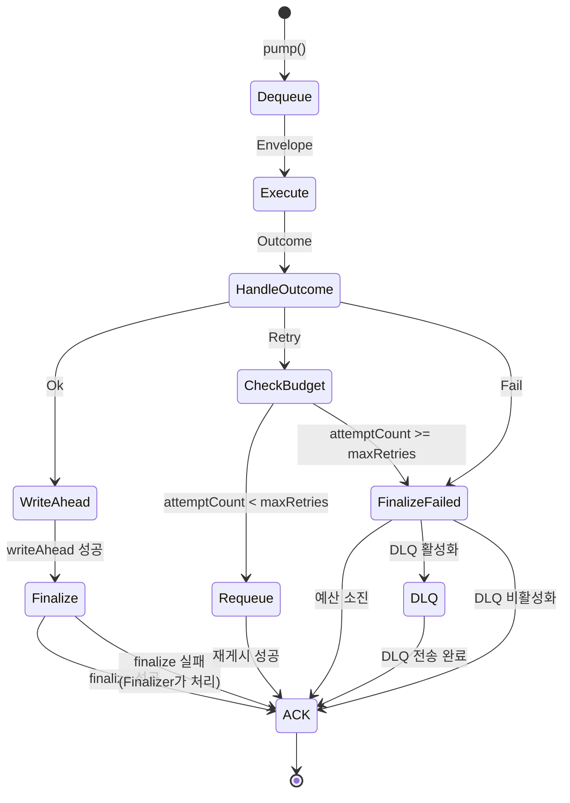
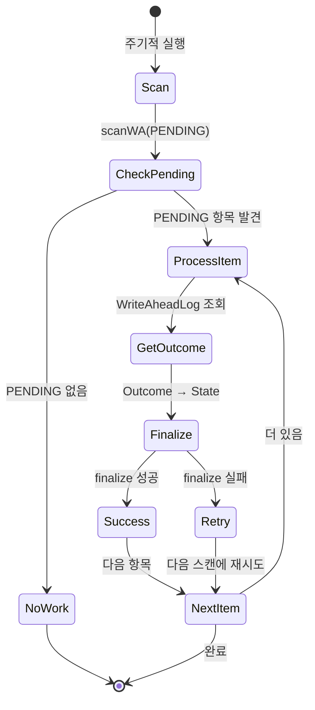
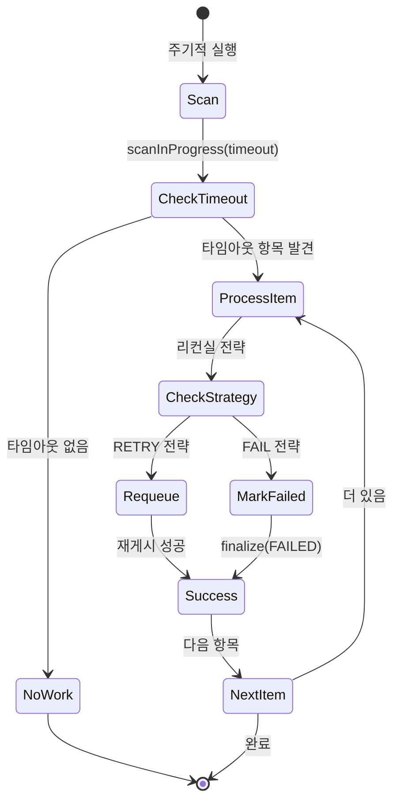

# OR-4: Queue Worker 및 Finalizer/Reaper 러너 구현 PRD

**작성일**: 2025-10-18
**작성자**: Orchestrator Team
**Epic**: OR-1 (Epic A: Core API 및 계약 구현)
**버전**: 1.0.0

---

## 1. Overview

### 1.1 목적

OR-4는 **Queue Worker 및 Finalizer/Reaper Runner**를 구현하는 작업으로, Orchestrator Core SDK의 비동기 실행 및 복구 메커니즘을 담당합니다. 이 러너들은 OR-3 Inline Fast-Path Runner가 처리하지 못한 비동기 작업을 큐에서 가져와 실행하고, 실패한 작업의 재시도, 그리고 장애 상황에서의 자동 복구를 책임집니다.

### 1.2 Epic OR-1과의 관계

Epic OR-1은 Orchestrator Core SDK의 기반 인프라를 구축하는 작업이며, OR-4는 다음 컴포넌트와 밀접하게 연관됩니다:

- **OR-2 (타입 모델 및 상태머신)**: OpId, Command, Envelope, Outcome, OperationState 활용
- **OR-3 (Inline Fast-Path Runner)**: Fast-Path에서 처리하지 못한 작업을 Queue로 전달받음
- **핵심 API 3개**: Runtime 인터페이스의 `pump()` 메서드 구현
- **Finalizer/Reaper**: 장애 복구 및 미종결 작업 정리

### 1.3 해결하는 문제

기존 비동기 작업 처리 방식의 문제점:

1. **타임아웃 처리 불완전**: Fast-Path 타임아웃 후 작업이 방치됨
2. **부분 실패 처리 부족**: writeAhead 성공 후 finalize 실패 시 복구 메커니즘 없음
3. **재시도 로직 부재**: 일시적 실패에 대한 체계적 재시도 전략 없음
4. **장기 미완료 작업**: 네트워크 장애 등으로 IN_PROGRESS 상태로 멈춘 작업 방치
5. **동시성 제어 부족**: 동일 OpId에 대한 중복 처리 가능성

**Queue Worker 및 Finalizer/Reaper의 해결책**:

- **Runtime.pump() 메시지 큐 처리**: 비동기 작업을 큐에서 가져와 체계적으로 처리
- **Outcome별 처리 전략**: Ok/Retry/Fail에 따른 명확한 처리 플로우
- **RetryBudget 관리**: 재시도 횟수 제한 및 Exponential Backoff 적용
- **Finalizer**: writeAhead 성공 but finalize 실패 케이스 자동 복구
- **Reaper**: 장기 IN_PROGRESS 작업 감지 및 리컨실

---

## 2. Requirements

### 2.1 기능 요구사항

#### FR-1: Runtime.pump() 메시지 큐 처리 루프

**설명**: 메시지 큐에서 작업을 가져와 실행하는 주기적 폴링 루프

**상세**:
- **메서드**: `void pump()`
  - 반환값 없음 (void)
  - 내부적으로 무한 루프 또는 스케줄링된 태스크로 실행
- **책임**:
  - 메시지 큐에서 Envelope dequeue
  - Executor.execute(envelope) 호출
  - Outcome 결과에 따른 분기 처리
  - 동시성 제어 (동일 OpId 중복 처리 방지)
  - 예외 처리 및 로깅

**의존성**: OR-2의 Envelope, Outcome 타입, Bus SPI (메시지 큐 추상화)

**설정 가능한 파라미터**:
```java
public class QueueWorkerConfig {
    private long pollingIntervalMs = 100;      // 폴링 간격 (기본 100ms)
    private int batchSize = 10;                // 한 번에 가져올 메시지 수
    private int concurrency = 5;               // 동시 처리 스레드 수
    private long maxProcessingTimeMs = 30000;  // 최대 처리 시간 (30초)
}
```

#### FR-2: Outcome.Ok 처리 플로우

**설명**: 작업 성공 시 결과 저장 및 상태 종결

**플로우**:
```
1. Outcome.Ok 수신
   ↓
2. writeAhead(opId, outcome) 호출
   - WriteAheadLog에 결과 기록 (영속성 보장)
   - 실패 시 예외 발생 → 메시지 큐에 재투입 (Retry)
   ↓
3. finalize(opId, COMPLETED) 호출
   - 상태머신 전이: IN_PROGRESS → COMPLETED
   - 실패 시 Finalizer가 나중에 처리
   ↓
4. 메시지 큐에서 ACK (완료 확인)
```

**보장사항**:
- **순서 보장**: writeAhead 성공 후에만 finalize 시도
- **멱등성**: 동일 OpId에 대해 여러 번 호출되어도 안전
- **복구 가능성**: finalize 실패 시 Finalizer가 복구

**의존성**: Store SPI의 `writeAhead()`, `finalize()` 메서드

#### FR-3: Outcome.Retry 처리 플로우

**설명**: 일시적 실패 시 재시도 로직 적용

**플로우**:
```
1. Outcome.Retry 수신
   - reason: "NetworkTimeout"
   - attemptCount: 2
   - nextRetryAfterMillis: 1000
   ↓
2. RetryBudget 확인
   if (attemptCount < maxRetries):
       ↓
   3. Backoff 계산
      - Exponential Backoff with Jitter
      - delay = min(baseDelay * 2^attemptCount + jitter, maxDelay)
      ↓
   4. 메시지 재게시
      - Bus.publish(envelope, delay)
      - visibility timeout 설정
      ↓
   5. 메시지 큐에서 ACK (현재 메시지 처리 완료)

   else (RetryBudget 소진):
       ↓
   6. finalize(opId, FAILED) 호출
      - 상태머신 전이: IN_PROGRESS → FAILED
      - 실패 사유 기록
      ↓
   7. 메시지 큐에서 ACK
```

**Backoff 전략**:
```java
public class ExponentialBackoff {
    private static final long BASE_DELAY_MS = 1000;     // 1초
    private static final long MAX_DELAY_MS = 300000;    // 5분
    private static final double JITTER_FACTOR = 0.1;    // 10% jitter

    public long calculateDelay(int attemptCount) {
        long exponential = BASE_DELAY_MS * (1L << attemptCount);
        long jitter = (long) (exponential * JITTER_FACTOR * Math.random());
        return Math.min(exponential + jitter, MAX_DELAY_MS);
    }
}
```

**RetryBudget 설정**:
```java
public class RetryBudgetConfig {
    private int maxRetries = 5;                         // 최대 재시도 횟수
    private long baseDelayMs = 1000;                    // 기본 지연 시간
    private long maxDelayMs = 300000;                   // 최대 지연 시간 (5분)
}
```

**의존성**: Bus SPI의 `publish()` (delayed message), Store SPI의 `finalize()`

#### FR-4: Outcome.Fail 처리 플로우

**설명**: 영구적 실패 시 즉시 종결

**플로우**:
```
1. Outcome.Fail 수신
   - errorCode: "PAY-001"
   - message: "Insufficient balance"
   ↓
2. finalize(opId, FAILED) 호출
   - 상태머신 전이: IN_PROGRESS → FAILED
   - 실패 사유 및 에러 코드 기록
   ↓
3. (선택적) Dead Letter Queue 전송
   - 실패 메시지를 DLQ로 이동
   - 수동 분석 및 재처리 대기
   ↓
4. 메시지 큐에서 ACK
```

**Dead Letter Queue (선택적)**:
- **목적**: 영구 실패한 메시지를 별도 큐로 이동하여 수동 분석
- **설정**:
  ```java
  public class DLQConfig {
      private boolean enabled = false;               // DLQ 사용 여부
      private String dlqName = "orchestrator-dlq";   // DLQ 이름
      private int maxRetentionDays = 7;              // DLQ 보관 기간
  }
  ```

**의존성**: Store SPI의 `finalize()`, Bus SPI의 `publishToDLQ()` (선택적)

#### FR-5: Finalizer 컴포넌트

**설명**: writeAhead 성공했지만 finalize 실패한 케이스를 주기적으로 스캔하여 복구

**동작 원리**:
```
1. 주기적 실행 (예: 1분마다)
   ↓
2. scanWA(PENDING) 호출
   - WriteAheadLog에서 PENDING 상태인 항목 조회
   - PENDING = writeAhead 성공 but finalize 미완료
   ↓
3. 각 항목에 대해:
   a. Outcome 조회 (WriteAheadLog에서)
   b. finalize(opId, outcome에 따른 상태) 재시도
      - Ok → COMPLETED
      - Fail → FAILED
   c. finalize 성공 시 WriteAheadLog 상태 업데이트
   d. finalize 실패 시 다음 스캔 주기에 재시도
```

**스캔 전략**:
```java
public class FinalizerConfig {
    private long scanIntervalMs = 60000;              // 스캔 주기 (1분)
    private int batchSize = 100;                      // 한 번에 처리할 항목 수
    private long maxPendingAgeMs = 300000;            // 최대 PENDING 시간 (5분)
}
```

**복구 시나리오**:
```
시나리오: writeAhead 성공 → finalize 시도 → DB 연결 실패
1. Outcome.Ok가 WriteAheadLog에 저장됨 (상태: PENDING)
2. finalize() 호출 시 DB 연결 예외 발생
3. 메시지 큐에서 ACK (중복 처리 방지)
4. Finalizer가 1분 후 스캔
5. PENDING 항목 발견 → finalize() 재시도
6. 성공 → 상태 COMPLETED로 변경
```

**의존성**: Store SPI의 `scanWA()`, `finalize()`

#### FR-6: Reaper 컴포넌트

**설명**: 장기 IN_PROGRESS 상태인 작업을 감지하고 리컨실

**동작 원리**:
```
1. 주기적 실행 (예: 5분마다)
   ↓
2. scanInProgress(timeout) 호출
   - IN_PROGRESS 상태이면서 타임아웃 임계값 초과한 작업 조회
   - timeout = 현재 시각 - acceptedAt > threshold
   ↓
3. 각 작업에 대해:
   a. 작업 상태 재확인 (외부 API 상태 체크 가능)
   b. 리컨실 전략 결정:
      - 재실행: Envelope을 큐에 재게시
      - 실패 처리: finalize(opId, FAILED)
   c. 상태 업데이트
```

**타임아웃 임계값**:
```java
public class ReaperConfig {
    private long scanIntervalMs = 300000;             // 스캔 주기 (5분)
    private long timeoutThresholdMs = 600000;         // 타임아웃 임계값 (10분)
    private int batchSize = 50;                       // 한 번에 처리할 항목 수
    private ReconcileStrategy defaultStrategy = FAIL; // 기본 리컨실 전략
}

public enum ReconcileStrategy {
    RETRY,    // 재실행
    FAIL      // 실패 처리
}
```

**리컨실 시나리오**:
```
시나리오: 외부 API 호출 중 네트워크 장애로 응답 수신 실패
1. Executor.execute() 호출 → 외부 API 요청
2. 네트워크 장애 → 응답 수신 실패
3. 상태: IN_PROGRESS로 유지 (Outcome 생성 안 됨)
4. Reaper가 5분 후 스캔
5. 10분 초과 IN_PROGRESS 작업 발견
6. 리컨실 전략:
   - Option A: 외부 API 상태 조회 → 성공 확인 → finalize(COMPLETED)
   - Option B: 타임아웃으로 판단 → finalize(FAILED)
   - Option C: 재실행 → Envelope 큐 재게시
```

**의존성**: Store SPI의 `scanInProgress()`, Bus SPI의 `publish()`, `finalize()`

#### FR-7: 동시성 제어

**설명**: 동일 OpId에 대한 중복 처리 방지 메커니즘

**문제 상황**:
- Queue Worker가 여러 인스턴스로 실행될 때
- 동일 OpId의 메시지가 중복으로 큐에 존재할 때 (재시도 등)
- Finalizer/Reaper와 Queue Worker가 동시에 같은 OpId 처리할 때

**해결 방안**:

**Option 1: 분산 락 (Distributed Lock)**
```java
public interface LockManager {
    /**
     * OpId에 대한 락 획득 시도.
     *
     * @param opId Operation ID
     * @param ttlMs 락 유효 시간 (밀리초)
     * @return 락 획득 성공 여부
     */
    boolean tryLock(OpId opId, long ttlMs);

    /**
     * OpId에 대한 락 해제.
     *
     * @param opId Operation ID
     */
    void unlock(OpId opId);
}
```

**사용 예시**:
```java
if (lockManager.tryLock(opId, 30000)) {
    try {
        // 작업 처리
        Outcome outcome = executor.execute(envelope);
        handleOutcome(opId, outcome);
    } finally {
        lockManager.unlock(opId);
    }
} else {
    // 다른 워커가 처리 중 → 스킵
    logger.info("OpId {} already locked, skipping", opId);
}
```

**Option 2: 메시지 큐 Visibility Timeout**
- 메시지를 dequeue하면 일정 시간(예: 30초) 동안 다른 워커에게 보이지 않음
- 처리 완료 후 ACK 또는 NACK
- ACK 시 메시지 삭제, NACK 시 재처리 가능하도록 다시 큐에 투입

**Option 3: 낙관적 락 (Optimistic Locking)**
```java
public class OperationRecord {
    private OpId opId;
    private OperationState state;
    private long version;  // 낙관적 락용 버전
}

// 상태 업데이트 시
UPDATE operations
SET state = 'COMPLETED', version = version + 1
WHERE opId = ? AND version = ?;
// 영향받은 행이 0이면 → 다른 워커가 이미 처리함
```

**OR-4 범위**: Option 2 (Visibility Timeout) 기본 제공, Option 1/3은 SPI로 확장 가능

**의존성**: Bus SPI의 visibility timeout 지원, LockManager SPI (선택적)

### 2.2 비기능 요구사항

#### NFR-1: 처리량 및 성능

**목표**: 단일 인스턴스 기준 100 TPS 이상 처리 가능

**측정 기준**:
- **pump() 처리 지연시간**: P95 < 50ms (메시지 dequeue → 처리 시작)
- **Outcome 처리 시간**: P95 < 100ms (Ok/Retry/Fail 분기 처리)
- **Finalizer 스캔 시간**: 1분 이내 (100개 항목 기준)
- **Reaper 스캔 시간**: 5분 이내 (50개 항목 기준)

**성능 시나리오**:
1. **정상 처리**: 80% Ok, 10% Retry, 10% Fail
   - 목표: 100 TPS 안정적 처리
2. **재시도 폭증**: Retry 비율 50%로 증가
   - 목표: 처리량 저하 < 30%
3. **Finalizer 부하**: PENDING 항목 1000개
   - 목표: 10분 내 모두 처리

#### NFR-2: 안정성 및 복구성

**장애 격리**:
- Queue Worker 장애 → Finalizer/Reaper는 계속 동작
- Finalizer 장애 → Queue Worker 및 Reaper는 계속 동작
- Reaper 장애 → Queue Worker 및 Finalizer는 계속 동작

**자동 복구**:
- Finalizer: writeAhead 성공 후 finalize 실패 → 자동 재시도
- Reaper: 장기 IN_PROGRESS → 자동 리컨실
- Retry: 일시적 실패 → 자동 재시도

**데이터 무결성**:
- writeAhead → finalize 순서 엄격 보장
- 상태 전이 불변식 준수 (StateTransition 활용)
- 멱등성 보장 (동일 OpId 중복 처리 안전)

#### NFR-3: 확장성

**수평 확장**:
- Queue Worker: 다중 인스턴스 배포 가능
- Finalizer: 분산 환경에서 중복 실행 안전 (멱등성)
- Reaper: 분산 환경에서 중복 실행 안전 (멱등성)

**수직 확장**:
- concurrency 설정으로 동시 처리 스레드 수 조정
- batchSize 설정으로 메모리/처리량 트레이드오프 조정

#### NFR-4: 관찰 가능성

**메트릭**:
- `orchestrator.pump.dequeue.count`: 큐에서 가져온 메시지 수
- `orchestrator.pump.outcome.ok.count`: Ok 처리 수
- `orchestrator.pump.outcome.retry.count`: Retry 처리 수
- `orchestrator.pump.outcome.fail.count`: Fail 처리 수
- `orchestrator.finalizer.scan.count`: Finalizer 스캔 횟수
- `orchestrator.finalizer.recovered.count`: 복구된 항목 수
- `orchestrator.reaper.scan.count`: Reaper 스캔 횟수
- `orchestrator.reaper.reconciled.count`: 리컨실된 항목 수

**로깅**:
- INFO: 메시지 처리 시작/완료, Finalizer/Reaper 스캔 시작/완료
- WARN: Retry 발생, RetryBudget 소진 임박, 타임아웃 근접
- ERROR: finalize 실패, 예외 발생, DLQ 전송

**추적 (Tracing)**:
- 각 OpId에 대한 전체 라이프사이클 추적
- pump() → execute() → handleOutcome() → finalize() 체인 추적

### 2.3 제약사항

#### 아키텍처 제약

**헥사고날 아키텍처 준수**:
- Queue Worker/Finalizer/Reaper는 **인프라 레이어** (adapter-runner 모듈)
- Runtime 인터페이스는 **애플리케이션 레이어**
- Bus/Store는 **SPI** (구체 구현은 사용자 제공)

**의존성 방향**:
```
adapter-runner (QueueWorker, Finalizer, Reaper)
  ↓ depends on
application (Runtime interface)
  ↓ depends on
domain (Executor, Store, Bus)
  ↓ depends on
core (OpId, Command, Envelope, Outcome)
```

#### 기술 스택 제약

**Spring Boot 3.5.x**:
- `@Scheduled` 어노테이션으로 주기적 실행
- `@Async` 또는 ExecutorService로 동시 처리
- 생성자 주입 방식 사용

**Java 21**:
- Virtual Thread 활용 (pump() 폴링, Finalizer/Reaper 스캔)
- Pattern Matching으로 Outcome 분기 처리
- Sealed Interface 준수 (Outcome)

**Lombok 금지**:
- Pure Java getter/setter 작성
- Builder 패턴 수동 구현

---

## 3. Technical Specifications

### 3.1 Runtime 인터페이스 설계

**위치**: `application/src/main/java/com/ryuqq/orchestrator/application/runtime/Runtime.java`

**인터페이스 정의**:
```java
package com.ryuqq.orchestrator.application.runtime;

/**
 * Runtime 실행 조정자.
 *
 * <p>메시지 큐에서 작업을 가져와 실행하고, 결과를 처리합니다.</p>
 *
 * @author Orchestrator Team
 * @since 1.0.0
 */
public interface Runtime {

    /**
     * 메시지 큐 폴링 및 작업 처리.
     *
     * <p>이 메서드는 주기적으로 호출되어 큐에서 메시지를 가져와 처리합니다.</p>
     * <p>블로킹 호출이 아니며, 처리 가능한 메시지가 없으면 즉시 반환합니다.</p>
     *
     * @throws RuntimeException 처리 중 복구 불가능한 예외 발생 시
     */
    void pump();
}
```

### 3.2 QueueWorkerRunner 구현 설계

**위치**: `adapter-runner/src/main/java/com/ryuqq/orchestrator/adapter/runner/QueueWorkerRunner.java`

**클래스 구조**:
```java
package com.ryuqq.orchestrator.adapter.runner;

import com.ryuqq.orchestrator.application.runtime.Runtime;
import com.ryuqq.orchestrator.core.contract.Envelope;
import com.ryuqq.orchestrator.core.model.OpId;
import com.ryuqq.orchestrator.core.outcome.Outcome;
import com.ryuqq.orchestrator.domain.executor.Executor;
import com.ryuqq.orchestrator.domain.spi.Bus;
import com.ryuqq.orchestrator.domain.spi.Store;

import java.util.List;

/**
 * Queue Worker Runner 구현체.
 *
 * <p>메시지 큐에서 작업을 가져와 실행하고, Outcome에 따라 처리합니다.</p>
 *
 * @author Orchestrator Team
 * @since 1.0.0
 */
public final class QueueWorkerRunner implements Runtime {

    private final Bus bus;
    private final Store store;
    private final Executor executor;
    private final QueueWorkerConfig config;
    private final BackoffCalculator backoffCalculator;

    /**
     * 생성자.
     *
     * @param bus 메시지 버스
     * @param store 저장소
     * @param executor 작업 실행자
     * @param config 설정
     */
    public QueueWorkerRunner(Bus bus, Store store, Executor executor,
                             QueueWorkerConfig config) {
        if (bus == null || store == null || executor == null || config == null) {
            throw new IllegalArgumentException("Dependencies cannot be null");
        }
        this.bus = bus;
        this.store = store;
        this.executor = executor;
        this.config = config;
        this.backoffCalculator = new ExponentialBackoffCalculator(config);
    }

    @Override
    public void pump() {
        List<Envelope> envelopes = bus.dequeue(config.getBatchSize());

        for (Envelope envelope : envelopes) {
            processEnvelope(envelope);
        }
    }

    private void processEnvelope(Envelope envelope) {
        OpId opId = envelope.opId();

        try {
            // 1. 실행
            Outcome outcome = executor.execute(envelope);

            // 2. Outcome 처리
            handleOutcome(opId, outcome, envelope);

            // 3. 메시지 ACK
            bus.ack(envelope);

        } catch (Exception e) {
            // 예외 발생 시 NACK (재처리 가능하도록)
            bus.nack(envelope);
            throw new RuntimeException("Failed to process envelope: " + opId, e);
        }
    }

    private void handleOutcome(OpId opId, Outcome outcome, Envelope envelope) {
        switch (outcome) {
            case Ok ok -> handleOk(opId, ok);
            case Retry retry -> handleRetry(opId, retry, envelope);
            case Fail fail -> handleFail(opId, fail);
        }
    }

    private void handleOk(OpId opId, Ok ok) {
        // 1. writeAhead
        store.writeAhead(opId, ok);

        // 2. finalize (실패해도 Finalizer가 복구)
        try {
            store.finalize(opId, OperationState.COMPLETED);
        } catch (Exception e) {
            // 로그만 남기고 계속 진행 (Finalizer가 처리)
            logger.warn("finalize failed for {}, will be handled by Finalizer", opId, e);
        }
    }

    private void handleRetry(OpId opId, Retry retry, Envelope envelope) {
        int attemptCount = retry.attemptCount();

        if (attemptCount < config.getMaxRetries()) {
            // 재시도 가능
            long delay = backoffCalculator.calculate(attemptCount);
            bus.publish(envelope, delay);
            logger.info("Retry scheduled for {} after {}ms (attempt {})",
                opId, delay, attemptCount);
        } else {
            // RetryBudget 소진
            store.finalize(opId, OperationState.FAILED);
            logger.warn("RetryBudget exhausted for {}, marked as FAILED", opId);
        }
    }

    private void handleFail(OpId opId, Fail fail) {
        // 즉시 실패 처리
        store.finalize(opId, OperationState.FAILED);
        logger.error("Operation {} failed: {} - {}",
            opId, fail.errorCode(), fail.message());

        // DLQ 전송 (선택적)
        if (config.isDlqEnabled()) {
            bus.publishToDLQ(envelope, fail);
        }
    }
}
```

### 3.3 Finalizer 구현 설계

**위치**: `adapter-runner/src/main/java/com/ryuqq/orchestrator/adapter/runner/Finalizer.java`

**클래스 구조**:
```java
package com.ryuqq.orchestrator.adapter.runner;

import com.ryuqq.orchestrator.core.model.OpId;
import com.ryuqq.orchestrator.core.outcome.Outcome;
import com.ryuqq.orchestrator.core.outcome.Ok;
import com.ryuqq.orchestrator.core.outcome.Fail;
import com.ryuqq.orchestrator.domain.spi.Store;
import com.ryuqq.orchestrator.domain.statemachine.OperationState;

import java.util.List;

/**
 * Finalizer 컴포넌트.
 *
 * <p>writeAhead 성공 후 finalize 실패한 항목을 주기적으로 복구합니다.</p>
 *
 * @author Orchestrator Team
 * @since 1.0.0
 */
public final class Finalizer {

    private final Store store;
    private final FinalizerConfig config;

    /**
     * 생성자.
     *
     * @param store 저장소
     * @param config 설정
     */
    public Finalizer(Store store, FinalizerConfig config) {
        if (store == null || config == null) {
            throw new IllegalArgumentException("Dependencies cannot be null");
        }
        this.store = store;
        this.config = config;
    }

    /**
     * PENDING 항목 스캔 및 복구.
     *
     * <p>주기적으로 호출되어야 합니다 (예: @Scheduled).</p>
     */
    public void scan() {
        logger.info("Finalizer scan started");

        List<OpId> pendingOpIds = store.scanWA(
            WriteAheadState.PENDING,
            config.getBatchSize()
        );

        int recovered = 0;
        for (OpId opId : pendingOpIds) {
            if (tryFinalize(opId)) {
                recovered++;
            }
        }

        logger.info("Finalizer scan completed: {} recovered out of {} pending",
            recovered, pendingOpIds.size());
    }

    private boolean tryFinalize(OpId opId) {
        try {
            // 1. WriteAheadLog에서 Outcome 조회
            Outcome outcome = store.getWriteAheadOutcome(opId);

            // 2. Outcome에 따라 finalize
            OperationState targetState = switch (outcome) {
                case Ok ok -> OperationState.COMPLETED;
                case Fail fail -> OperationState.FAILED;
                case Retry retry -> {
                    // Retry는 PENDING 상태로 남아있으면 안 됨 (이상 케이스)
                    logger.warn("Unexpected Retry in WriteAheadLog for {}", opId);
                    yield OperationState.FAILED;
                }
            };

            // 3. finalize 시도
            store.finalize(opId, targetState);
            logger.info("Finalizer recovered {}: {} → {}",
                opId, OperationState.IN_PROGRESS, targetState);
            return true;

        } catch (Exception e) {
            logger.error("Failed to finalize {} in Finalizer scan", opId, e);
            return false;
        }
    }
}
```

### 3.4 Reaper 구현 설계

**위치**: `adapter-runner/src/main/java/com/ryuqq/orchestrator/adapter/runner/Reaper.java`

**클래스 구조**:
```java
package com.ryuqq.orchestrator.adapter.runner;

import com.ryuqq.orchestrator.core.contract.Envelope;
import com.ryuqq.orchestrator.core.model.OpId;
import com.ryuqq.orchestrator.domain.spi.Bus;
import com.ryuqq.orchestrator.domain.spi.Store;
import com.ryuqq.orchestrator.domain.statemachine.OperationState;

import java.util.List;

/**
 * Reaper 컴포넌트.
 *
 * <p>장기 IN_PROGRESS 작업을 감지하고 리컨실합니다.</p>
 *
 * @author Orchestrator Team
 * @since 1.0.0
 */
public final class Reaper {

    private final Store store;
    private final Bus bus;
    private final ReaperConfig config;

    /**
     * 생성자.
     *
     * @param store 저장소
     * @param bus 메시지 버스
     * @param config 설정
     */
    public Reaper(Store store, Bus bus, ReaperConfig config) {
        if (store == null || bus == null || config == null) {
            throw new IllegalArgumentException("Dependencies cannot be null");
        }
        this.store = store;
        this.bus = bus;
        this.config = config;
    }

    /**
     * 장기 IN_PROGRESS 작업 스캔 및 리컨실.
     *
     * <p>주기적으로 호출되어야 합니다 (예: @Scheduled).</p>
     */
    public void scan() {
        logger.info("Reaper scan started");

        long now = System.currentTimeMillis();
        long timeoutThreshold = now - config.getTimeoutThresholdMs();

        List<OpId> timedOutOpIds = store.scanInProgress(
            timeoutThreshold,
            config.getBatchSize()
        );

        int reconciled = 0;
        for (OpId opId : timedOutOpIds) {
            if (reconcile(opId)) {
                reconciled++;
            }
        }

        logger.info("Reaper scan completed: {} reconciled out of {} timed-out",
            reconciled, timedOutOpIds.size());
    }

    private boolean reconcile(OpId opId) {
        try {
            ReconcileStrategy strategy = config.getDefaultStrategy();

            switch (strategy) {
                case RETRY -> {
                    // Envelope 재게시
                    Envelope envelope = store.getEnvelope(opId);
                    bus.publish(envelope, 0);
                    logger.info("Reaper requeued {} for retry", opId);
                }
                case FAIL -> {
                    // 실패 처리
                    store.finalize(opId, OperationState.FAILED);
                    logger.warn("Reaper marked {} as FAILED due to timeout", opId);
                }
            }

            return true;

        } catch (Exception e) {
            logger.error("Failed to reconcile {} in Reaper scan", opId, e);
            return false;
        }
    }
}
```

### 3.5 Backoff 계산 알고리즘

**Exponential Backoff with Jitter**:

```java
/**
 * Exponential Backoff 계산기.
 *
 * @author Orchestrator Team
 * @since 1.0.0
 */
public final class ExponentialBackoffCalculator implements BackoffCalculator {

    private final long baseDelayMs;
    private final long maxDelayMs;
    private final double jitterFactor;
    private final Random random;

    public ExponentialBackoffCalculator(QueueWorkerConfig config) {
        this.baseDelayMs = config.getBaseDelayMs();
        this.maxDelayMs = config.getMaxDelayMs();
        this.jitterFactor = 0.1; // 10% jitter
        this.random = new Random();
    }

    @Override
    public long calculate(int attemptCount) {
        // Exponential: baseDelay * 2^attemptCount
        long exponential = baseDelayMs * (1L << attemptCount);

        // Jitter: ±10% 랜덤
        long jitter = (long) (exponential * jitterFactor * (random.nextDouble() - 0.5) * 2);

        // Cap to maxDelay
        long delay = exponential + jitter;
        return Math.min(delay, maxDelayMs);
    }
}
```

**계산 예시**:
```
baseDelay = 1000ms, maxDelay = 300000ms (5분)

attemptCount | exponential | jitter (±10%) | final delay
-------------|-------------|---------------|-------------
1            | 1000ms      | ±100ms        | 900~1100ms
2            | 2000ms      | ±200ms        | 1800~2200ms
3            | 4000ms      | ±400ms        | 3600~4400ms
4            | 8000ms      | ±800ms        | 7200~8800ms
5            | 16000ms     | ±1600ms       | 14400~17600ms
10           | 1024000ms   | capped        | 300000ms (max)
```

### 3.6 상태 전이 다이어그램

**Queue Worker 처리 플로우**:



**Finalizer 복구 플로우**:



**Reaper 리컨실 플로우**:



---

## 4. Implementation Plan

### 4.1 작업 분해 (TodoList 기반)

#### Task 1: 브랜치 생성 및 체크아웃

**목표**: 작업 브랜치 생성

```bash
git checkout -b feature/OR-4-queue-worker-finalizer-reaper
```

**상태**: 대기

#### Task 2: Runtime 인터페이스 정의

**목표**: `Runtime.java` 인터페이스 작성

**작업 내용**:
- `pump()` 메서드 시그니처 정의
- Javadoc 작성 (`@author`, `@since`)
- package-info.java 작성

**위치**: `application/src/main/java/.../runtime/Runtime.java`

**검증**: 컴파일 성공, Javadoc 생성 확인

#### Task 3: QueueWorkerRunner 골격 구현

**목표**: `QueueWorkerRunner.java` 기본 구조 작성

**작업 내용**:
- 생성자 및 필드 정의
- `pump()` 메서드 골격 (dequeue → process loop)
- `processEnvelope()` 메서드 골격
- `handleOutcome()` switch expression

**위치**: `adapter-runner/src/main/java/.../runner/QueueWorkerRunner.java`

**검증**: 컴파일 성공

#### Task 4: Outcome.Ok 처리 로직 구현

**목표**: `handleOk()` 메서드 완성

**작업 내용**:
- `store.writeAhead()` 호출
- `store.finalize()` 호출 (try-catch)
- 예외 처리 로직
- 로깅 추가

**검증**: 유닛 테스트 작성

#### Task 5: Outcome.Retry 처리 로직 구현

**목표**: `handleRetry()` 메서드 완성

**작업 내용**:
- RetryBudget 확인 로직
- Backoff 계산 (`BackoffCalculator`)
- `bus.publish(envelope, delay)` 호출
- RetryBudget 소진 시 finalize(FAILED)

**검증**: 유닛 테스트 작성

#### Task 6: Outcome.Fail 처리 로직 구현

**목표**: `handleFail()` 메서드 완성

**작업 내용**:
- `store.finalize(opId, FAILED)` 호출
- DLQ 전송 로직 (선택적)
- 로깅 추가

**검증**: 유닛 테스트 작성

#### Task 7: BackoffCalculator 구현

**목표**: Exponential Backoff with Jitter 알고리즘 구현

**작업 내용**:
- `ExponentialBackoffCalculator` 클래스 작성
- `calculate(attemptCount)` 메서드 구현
- Jitter 로직 추가

**검증**: 유닛 테스트 (다양한 attemptCount 케이스)

#### Task 8: Finalizer 구현

**목표**: `Finalizer.java` 클래스 구현

**작업 내용**:
- `scan()` 메서드 구현
- `tryFinalize()` 메서드 구현
- WriteAheadLog 조회 로직
- finalize 재시도 로직

**위치**: `adapter-runner/src/main/java/.../runner/Finalizer.java`

**검증**: 유닛 테스트 작성

#### Task 9: Reaper 구현

**목표**: `Reaper.java` 클래스 구현

**작업 내용**:
- `scan()` 메서드 구현
- `reconcile()` 메서드 구현
- ReconcileStrategy 분기 로직
- 타임아웃 계산 로직

**위치**: `adapter-runner/src/main/java/.../runner/Reaper.java`

**검증**: 유닛 테스트 작성

#### Task 10: 설정 클래스 구현

**목표**: Config 클래스들 작성

**작업 내용**:
- `QueueWorkerConfig.java`
- `FinalizerConfig.java`
- `ReaperConfig.java`
- 기본값 설정 및 검증 로직

**검증**: 유닛 테스트 (유효성 검증)

#### Task 11: 유닛 테스트 - Ok 처리 시 writeAhead → finalize 순서 보장

**목표**: Acceptance Criteria #1 검증

**테스트 시나리오**:
- Outcome.Ok 수신
- writeAhead 성공 확인
- finalize 호출 확인 (순서 보장)

**Mock**: Store.writeAhead(), Store.finalize()

**검증**: writeAhead가 finalize보다 먼저 호출됨

#### Task 12: 유닛 테스트 - Retry 시 RetryBudget 소진 → finalize(FAILED)

**목표**: Acceptance Criteria #2 검증

**테스트 시나리오**:
- Outcome.Retry 수신 (attemptCount = maxRetries)
- RetryBudget 소진 확인
- finalize(FAILED) 호출 확인

**검증**: finalize가 FAILED 상태로 호출됨

#### Task 13: 유닛 테스트 - Finalizer가 writeAhead 성공 but finalize 실패 복구

**목표**: Acceptance Criteria #3 검증

**테스트 시나리오**:
- WriteAheadLog에 PENDING 항목 존재
- Finalizer.scan() 호출
- finalize 재시도 확인
- 상태 COMPLETED로 변경 확인

**검증**: Finalizer가 성공적으로 복구함

#### Task 14: 유닛 테스트 - 장기 IN_PROGRESS 자동 리컨실

**목표**: Acceptance Criteria #4 검증

**테스트 시나리오**:
- 10분 초과 IN_PROGRESS 작업 존재
- Reaper.scan() 호출
- 리컨실 전략 실행 확인 (RETRY 또는 FAIL)

**검증**: Reaper가 타임아웃 작업을 처리함

#### Task 15: 유닛 테스트 - 동시성 제어 (동일 OpId 중복 처리 방지)

**목표**: Acceptance Criteria #5 검증

**테스트 시나리오**:
- 동일 OpId의 메시지를 여러 스레드에서 동시 처리
- 중복 처리 방지 확인 (Visibility Timeout 또는 Lock)

**검증**: 하나의 스레드만 처리 성공

#### Task 16: 통합 테스트 - 전체 플로우

**목표**: Queue Worker → Finalizer → Reaper 통합 시나리오

**테스트 시나리오**:
1. Queue Worker가 Ok 처리 → writeAhead 성공, finalize 실패
2. Finalizer 스캔 → 복구 성공
3. Reaper가 타임아웃 작업 감지 → 리컨실

**검증**: 전체 플로우가 정상 작동

#### Task 17: Javadoc 작성

**목표**: 모든 공개 API Javadoc 작성

**대상**:
- Runtime 인터페이스
- QueueWorkerRunner 클래스
- Finalizer 클래스
- Reaper 클래스

**포함 내용**:
- `@author Orchestrator Team`
- `@since 1.0.0`
- `@param`, `@return`, `@throws` 상세 설명

**검증**: `mvn javadoc:javadoc` 성공

#### Task 18: 테스트 커버리지 ≥ 80% 확인

**목표**: JaCoCo 커버리지 확인

**대상**:
- QueueWorkerRunner
- Finalizer
- Reaper

**커버리지 타겟**:
- Line Coverage: ≥ 80%
- Branch Coverage: ≥ 70%

**검증**: `mvn test jacoco:report`

#### Task 19: 코드 리뷰 준비

**목표**: 리뷰 가능한 상태로 정리

**체크리스트**:
- [ ] 모든 테스트 통과
- [ ] Javadoc 완성
- [ ] Lombok 미사용 확인
- [ ] Law of Demeter 준수
- [ ] 커밋 메시지 정리

#### Task 20: PR 생성

**목표**: Epic OR-1 리뷰 요청

**PR 템플릿**:
- **제목**: `[OR-4] Queue Worker 및 Finalizer/Reaper 러너 구현`
- **설명**:
  - 구현 내용 요약
  - Acceptance Criteria 충족 여부
  - 테스트 커버리지 리포트
- **리뷰어**: Epic OR-1 담당자

### 4.2 작업 일정 (예상)

| Task | 예상 시간 | 의존성 |
|------|-----------|--------|
| Task 1 (브랜치) | 10분 | - |
| Task 2 (Runtime IF) | 1시간 | Task 1 |
| Task 3 (QueueWorker 골격) | 2시간 | Task 2 |
| Task 4 (Ok 처리) | 2시간 | Task 3 |
| Task 5 (Retry 처리) | 3시간 | Task 4 |
| Task 6 (Fail 처리) | 1시간 | Task 5 |
| Task 7 (Backoff) | 2시간 | Task 5 |
| Task 8 (Finalizer) | 3시간 | Task 4 |
| Task 9 (Reaper) | 3시간 | Task 6 |
| Task 10 (Config) | 2시간 | Task 3 |
| Task 11-15 (유닛 테스트) | 6시간 | Task 4-9 |
| Task 16 (통합 테스트) | 4시간 | Task 15 |
| Task 17 (Javadoc) | 2시간 | Task 16 |
| Task 18 (커버리지) | 1시간 | Task 17 |
| Task 19-20 (리뷰/PR) | 2시간 | Task 18 |
| **총합** | **34시간** | |

---

## 5. Testing Strategy

### 5.1 유닛 테스트

#### QueueWorkerRunnerTest

**Ok 처리 테스트**:
```java
@Test
void handleOk_성공_시_writeAhead_and_finalize_순서_보장() {
    // given
    OpId opId = OpId.of("test-ok");
    Ok ok = Ok.of(opId);
    Store mockStore = mock(Store.class);

    // when
    queueWorker.handleOk(opId, ok);

    // then
    InOrder inOrder = inOrder(mockStore);
    inOrder.verify(mockStore).writeAhead(opId, ok);
    inOrder.verify(mockStore).finalize(opId, OperationState.COMPLETED);
}

@Test
void handleOk_finalize_실패_시_예외_무시() {
    // given
    OpId opId = OpId.of("test-ok");
    Ok ok = Ok.of(opId);
    Store mockStore = mock(Store.class);
    doThrow(new RuntimeException("DB error"))
        .when(mockStore).finalize(any(), any());

    // when & then
    assertDoesNotThrow(() -> queueWorker.handleOk(opId, ok));
    verify(mockStore).writeAhead(opId, ok);
}
```

**Retry 처리 테스트**:
```java
@Test
void handleRetry_예산_내_재시도() {
    // given
    OpId opId = OpId.of("test-retry");
    Retry retry = new Retry("timeout", 2, 1000);
    Envelope envelope = createTestEnvelope(opId);
    Bus mockBus = mock(Bus.class);

    // when
    queueWorker.handleRetry(opId, retry, envelope);

    // then
    verify(mockBus).publish(eq(envelope), anyLong());
    verify(store, never()).finalize(any(), eq(OperationState.FAILED));
}

@Test
void handleRetry_예산_소진_시_FAILED_처리() {
    // given
    OpId opId = OpId.of("test-retry-exhausted");
    Retry retry = new Retry("timeout", 5, 1000); // maxRetries = 5

    // when
    queueWorker.handleRetry(opId, retry, envelope);

    // then
    verify(bus, never()).publish(any(), anyLong());
    verify(store).finalize(opId, OperationState.FAILED);
}
```

**Fail 처리 테스트**:
```java
@Test
void handleFail_즉시_FAILED_처리() {
    // given
    OpId opId = OpId.of("test-fail");
    Fail fail = Fail.of("ERR-001", "Payment failed");

    // when
    queueWorker.handleFail(opId, fail);

    // then
    verify(store).finalize(opId, OperationState.FAILED);
}
```

#### FinalizerTest

```java
@Test
void scan_PENDING_항목_복구() {
    // given
    OpId opId = OpId.of("pending-1");
    Ok ok = Ok.of(opId);
    when(store.scanWA(WriteAheadState.PENDING, batchSize))
        .thenReturn(List.of(opId));
    when(store.getWriteAheadOutcome(opId))
        .thenReturn(ok);

    // when
    finalizer.scan();

    // then
    verify(store).finalize(opId, OperationState.COMPLETED);
}

@Test
void scan_finalize_실패_시_다음_스캔_대기() {
    // given
    OpId opId = OpId.of("pending-fail");
    when(store.scanWA(WriteAheadState.PENDING, batchSize))
        .thenReturn(List.of(opId));
    doThrow(new RuntimeException("DB error"))
        .when(store).finalize(any(), any());

    // when & then
    assertDoesNotThrow(() -> finalizer.scan());
    verify(store).finalize(opId, OperationState.COMPLETED);
    // 실패해도 예외 전파하지 않음 (다음 스캔에서 재시도)
}
```

#### ReaperTest

```java
@Test
void scan_타임아웃_작업_RETRY_전략() {
    // given
    OpId opId = OpId.of("timeout-1");
    Envelope envelope = createTestEnvelope(opId);
    when(store.scanInProgress(anyLong(), anyInt()))
        .thenReturn(List.of(opId));
    when(store.getEnvelope(opId))
        .thenReturn(envelope);
    config.setDefaultStrategy(ReconcileStrategy.RETRY);

    // when
    reaper.scan();

    // then
    verify(bus).publish(envelope, 0);
    verify(store, never()).finalize(any(), any());
}

@Test
void scan_타임아웃_작업_FAIL_전략() {
    // given
    OpId opId = OpId.of("timeout-2");
    when(store.scanInProgress(anyLong(), anyInt()))
        .thenReturn(List.of(opId));
    config.setDefaultStrategy(ReconcileStrategy.FAIL);

    // when
    reaper.scan();

    // then
    verify(store).finalize(opId, OperationState.FAILED);
    verify(bus, never()).publish(any(), anyLong());
}
```

#### BackoffCalculatorTest

```java
@Test
void exponentialBackoff_계산_정확성() {
    BackoffCalculator calculator = new ExponentialBackoffCalculator(config);

    // attemptCount = 1 → ~1000ms
    long delay1 = calculator.calculate(1);
    assertTrue(delay1 >= 900 && delay1 <= 1100); // ±10% jitter

    // attemptCount = 3 → ~4000ms
    long delay3 = calculator.calculate(3);
    assertTrue(delay3 >= 3600 && delay3 <= 4400);

    // attemptCount = 10 → maxDelay (300000ms)
    long delay10 = calculator.calculate(10);
    assertEquals(300000, delay10);
}
```

### 5.2 통합 테스트

#### 전체 플로우 통합 테스트

```java
@SpringBootTest
class QueueWorkerIntegrationTest {

    @Autowired
    private Runtime runtime;

    @Autowired
    private Store store;

    @Autowired
    private Bus bus;

    @Test
    void 전체_플로우_Ok_처리() {
        // given
        Command command = createTestCommand();
        Envelope envelope = Envelope.now(OpId.of("integration-1"), command);
        bus.publish(envelope, 0);

        // when
        runtime.pump();

        // then
        OperationState state = store.getState(envelope.opId());
        assertEquals(OperationState.COMPLETED, state);
    }

    @Test
    void Retry_재시도_후_성공() {
        // given
        Command command = createTestCommand();
        OpId opId = OpId.of("integration-retry");
        Envelope envelope = Envelope.now(opId, command);
        bus.publish(envelope, 0);

        // when - 첫 시도: Retry
        runtime.pump();

        // then - 메시지 재게시 확인
        assertTrue(bus.hasMessage(opId));

        // when - 두 번째 시도: Ok
        runtime.pump();

        // then - 성공 완료
        OperationState state = store.getState(opId);
        assertEquals(OperationState.COMPLETED, state);
    }

    @Test
    void Finalizer_복구_시나리오() {
        // given - writeAhead 성공, finalize 실패 상황 모의
        OpId opId = OpId.of("finalizer-test");
        Ok ok = Ok.of(opId);
        store.writeAhead(opId, ok);
        // finalize는 실패했다고 가정 (PENDING 상태 유지)

        // when
        finalizer.scan();

        // then
        OperationState state = store.getState(opId);
        assertEquals(OperationState.COMPLETED, state);
    }

    @Test
    void Reaper_타임아웃_처리() {
        // given - 10분 초과 IN_PROGRESS 작업
        OpId opId = OpId.of("reaper-test");
        Command command = createTestCommand();
        Envelope envelope = Envelope.now(opId, command);
        store.save(envelope, OperationState.IN_PROGRESS);
        // acceptedAt을 10분 이전으로 설정
        store.updateAcceptedAt(opId, System.currentTimeMillis() - 600000);

        // when
        reaper.scan();

        // then
        OperationState state = store.getState(opId);
        assertEquals(OperationState.FAILED, state);
    }
}
```

### 5.3 동시성 테스트

```java
@Test
void 동일_OpId_중복_처리_방지() throws Exception {
    // given
    OpId opId = OpId.of("concurrent-test");
    Envelope envelope = createTestEnvelope(opId);

    // 동일 메시지를 큐에 여러 개 추가
    for (int i = 0; i < 10; i++) {
        bus.publish(envelope, 0);
    }

    int threadCount = 5;
    ExecutorService executorService = Executors.newFixedThreadPool(threadCount);
    CountDownLatch latch = new CountDownLatch(threadCount);

    AtomicInteger processedCount = new AtomicInteger(0);

    // when - 여러 스레드에서 동시에 pump() 호출
    for (int i = 0; i < threadCount; i++) {
        executorService.submit(() -> {
            try {
                runtime.pump();
                processedCount.incrementAndGet();
            } finally {
                latch.countDown();
            }
        });
    }

    latch.await(10, TimeUnit.SECONDS);
    executorService.shutdown();

    // then - 동일 OpId는 한 번만 처리됨
    verify(store, times(1)).finalize(eq(opId), any());
}
```

### 5.4 성능 테스트

#### 처리량 테스트

**목표**: 100 TPS 이상 처리

```java
@Test
void pump_처리량_100_TPS_이상() {
    // given
    int messageCount = 1000;
    for (int i = 0; i < messageCount; i++) {
        OpId opId = OpId.of("perf-" + i);
        Envelope envelope = createTestEnvelope(opId);
        bus.publish(envelope, 0);
    }

    // when
    long startTime = System.currentTimeMillis();

    while (bus.hasMessages()) {
        runtime.pump();
    }

    long duration = System.currentTimeMillis() - startTime;

    // then
    double tps = (messageCount * 1000.0) / duration;
    assertTrue(tps >= 100, "TPS: " + tps);
}
```

#### 지연시간 테스트

**목표**: P95 < 50ms

```java
@Test
void pump_지연시간_P95_50ms_이하() {
    // given
    int sampleCount = 1000;
    List<Long> latencies = new ArrayList<>();

    // when
    for (int i = 0; i < sampleCount; i++) {
        OpId opId = OpId.of("latency-" + i);
        Envelope envelope = createTestEnvelope(opId);
        bus.publish(envelope, 0);

        long startTime = System.nanoTime();
        runtime.pump();
        long latency = (System.nanoTime() - startTime) / 1_000_000; // ms

        latencies.add(latency);
    }

    // then
    Collections.sort(latencies);
    long p95 = latencies.get((int) (sampleCount * 0.95));
    assertTrue(p95 < 50, "P95 latency: " + p95 + "ms");
}
```

---

## 6. Acceptance Criteria (상세)

### AC-1: Ok 처리 시 writeAhead → finalize 순서 보장 테스트

**조건**:
- Outcome.Ok 수신
- writeAhead 성공
- finalize 호출 (성공 또는 실패)

**검증 방법**:
```java
@Test
void AC1_Ok_처리_순서_보장() {
    // given
    OpId opId = OpId.of("ac1-test");
    Ok ok = Ok.of(opId);

    // when
    queueWorker.handleOk(opId, ok);

    // then
    InOrder inOrder = inOrder(store);
    inOrder.verify(store).writeAhead(opId, ok);
    inOrder.verify(store).finalize(opId, OperationState.COMPLETED);
}
```

**성공 기준**:
- writeAhead가 finalize보다 먼저 호출됨
- finalize 실패 시에도 예외 전파하지 않음 (Finalizer가 처리)

### AC-2: Retry 시 RetryBudget 소진되면 finalize(FAILED) 테스트

**조건**:
- Outcome.Retry 수신
- attemptCount >= maxRetries

**검증 방법**:
```java
@Test
void AC2_RetryBudget_소진_시_FAILED() {
    // given
    OpId opId = OpId.of("ac2-test");
    Retry retry = new Retry("timeout", 5, 1000); // maxRetries = 5
    Envelope envelope = createTestEnvelope(opId);

    // when
    queueWorker.handleRetry(opId, retry, envelope);

    // then
    verify(bus, never()).publish(any(), anyLong());
    verify(store).finalize(opId, OperationState.FAILED);
}
```

**성공 기준**:
- RetryBudget 소진 시 메시지 재게시하지 않음
- finalize(FAILED) 호출됨

### AC-3: Finalizer가 writeAhead 성공 but finalize 실패 케이스 복구 테스트

**조건**:
- WriteAheadLog에 PENDING 상태 항목 존재
- Finalizer.scan() 실행

**검증 방법**:
```java
@Test
void AC3_Finalizer_복구() {
    // given
    OpId opId = OpId.of("ac3-test");
    Ok ok = Ok.of(opId);
    store.writeAhead(opId, ok); // PENDING 상태로 저장

    // when
    finalizer.scan();

    // then
    verify(store).finalize(opId, OperationState.COMPLETED);
    assertEquals(OperationState.COMPLETED, store.getState(opId));
}
```

**성공 기준**:
- Finalizer가 PENDING 항목 감지
- finalize 재시도 성공
- 상태 COMPLETED로 변경

### AC-4: 장기 IN_PROGRESS 자동 리컨실 테스트

**조건**:
- IN_PROGRESS 상태이면서 타임아웃 초과 (10분)
- Reaper.scan() 실행

**검증 방법**:
```java
@Test
void AC4_Reaper_타임아웃_리컨실() {
    // given
    OpId opId = OpId.of("ac4-test");
    Envelope envelope = createTestEnvelope(opId);
    store.save(envelope, OperationState.IN_PROGRESS);
    store.updateAcceptedAt(opId, System.currentTimeMillis() - 600000); // 10분 전

    // when
    reaper.scan();

    // then
    OperationState state = store.getState(opId);
    assertTrue(state == OperationState.FAILED || state == OperationState.IN_PROGRESS);
    // FAIL 전략 → FAILED
    // RETRY 전략 → 재게시 후 IN_PROGRESS 유지 또는 변경
}
```

**성공 기준**:
- Reaper가 타임아웃 작업 감지
- ReconcileStrategy에 따라 처리 (RETRY 또는 FAIL)

### AC-5: 동시성 제어: 동일 OpId 중복 처리 방지 테스트

**조건**:
- 동일 OpId의 메시지를 여러 스레드에서 동시 처리

**검증 방법**:
```java
@Test
void AC5_동시성_제어() throws Exception {
    // given
    OpId opId = OpId.of("ac5-test");
    Envelope envelope = createTestEnvelope(opId);

    // 동일 메시지를 여러 개 큐에 추가
    for (int i = 0; i < 10; i++) {
        bus.publish(envelope, 0);
    }

    int threadCount = 5;
    ExecutorService executorService = Executors.newFixedThreadPool(threadCount);
    CountDownLatch latch = new CountDownLatch(threadCount);

    // when
    for (int i = 0; i < threadCount; i++) {
        executorService.submit(() -> {
            try {
                runtime.pump();
            } finally {
                latch.countDown();
            }
        });
    }

    latch.await(10, TimeUnit.SECONDS);
    executorService.shutdown();

    // then
    verify(store, times(1)).finalize(eq(opId), any());
}
```

**성공 기준**:
- 동일 OpId는 한 번만 finalize 호출됨
- Visibility Timeout 또는 Lock으로 중복 처리 방지

---

## 7. Dependencies

### 7.1 OR-2 의존성

**타입 모델**:
- `OpId`: Operation 식별자
- `Command`: 실행 명령
- `Envelope`: Command + OpId + acceptedAt
- `Outcome`: 실행 결과 (Ok, Retry, Fail)
- `OperationState`: 상태 (PENDING, IN_PROGRESS, COMPLETED, FAILED)

**상태머신**:
- `StateTransition.validate()`: 상태 전이 검증

**OR-4가 OR-2에 의존하는 이유**:
- QueueWorker가 Envelope 처리
- Outcome 타입별 분기 처리
- StateTransition으로 상태 전이 보장

### 7.2 OR-3 의존성

**Fast-Path 연계**:
- OR-3에서 timeBudget 초과 시 메시지 큐에 투입
- OR-4 Queue Worker가 해당 메시지 처리
- OperationHandle.async() 응답 후 백그라운드 실행 계속

**예시 플로우**:
```
1. 클라이언트 → Orchestrator.submit(command, 200ms)
2. OR-3 InlineFastPathRunner: timeBudget 내 완료 못 함
3. OperationHandle.async() 반환 (202 응답)
4. Bus.publish(envelope, 0) → 메시지 큐에 투입
5. OR-4 QueueWorker: pump() → dequeue → execute → handleOutcome
```

### 7.3 SPI 의존성

**Bus SPI**:
```java
public interface Bus {
    void publish(Envelope envelope, long delayMs);
    List<Envelope> dequeue(int batchSize);
    void ack(Envelope envelope);
    void nack(Envelope envelope);
    void publishToDLQ(Envelope envelope, Fail fail);
}
```

**Store SPI**:
```java
public interface Store {
    void writeAhead(OpId opId, Outcome outcome);
    void finalize(OpId opId, OperationState state);
    List<OpId> scanWA(WriteAheadState state, int batchSize);
    Outcome getWriteAheadOutcome(OpId opId);
    List<OpId> scanInProgress(long timeoutThreshold, int batchSize);
    Envelope getEnvelope(OpId opId);
    OperationState getState(OpId opId);
}
```

### 7.4 외부 의존성

**Spring Boot**:
- `spring-boot-starter`: 기본 의존성
- `spring-boot-starter-test`: 테스트 의존성
- `@Scheduled`: 주기적 실행 (Finalizer, Reaper)

**JUnit 5**:
- `junit-jupiter`: 유닛 테스트
- `mockito-core`: Mock 객체

**JaCoCo**:
- 테스트 커버리지 측정

---

## 8. Risks & Mitigation

### 8.1 메시지 큐 장애 리스크

**리스크**:
- Bus 구현체 장애 시 메시지 유실 가능
- dequeue 실패 시 작업 처리 중단

**영향**:
- 비동기 작업 처리 불가
- Fast-Path 타임아웃 후 작업 방치

**완화 전략**:
1. **DLQ 활용**: 처리 실패 메시지를 DLQ로 이동
2. **Reaper 복구**: 장기 IN_PROGRESS 작업을 Reaper가 리컨실
3. **메시지 큐 HA**: Bus 구현체를 고가용성으로 구성 (사용자 책임)
4. **모니터링**: 메시지 큐 상태 메트릭 수집

### 8.2 Finalizer/Reaper 성능 리스크

**리스크**:
- PENDING 항목이 수천 개로 증가 시 스캔 시간 초과
- Reaper 스캔 중 DB 부하 증가

**영향**:
- Finalizer/Reaper 실행 지연
- 데이터베이스 성능 저하

**완화 전략**:
1. **batchSize 제한**: 한 번에 처리할 항목 수 제한 (예: 100개)
2. **인덱스 최적화**: scanWA, scanInProgress 쿼리에 인덱스 적용
3. **스캔 주기 조정**: 부하에 따라 scanInterval 동적 조정
4. **파티셔닝**: 대량 데이터 시 테이블 파티셔닝 고려

### 8.3 동시성 제어 실패 리스크

**리스크**:
- Visibility Timeout 미지원 Bus 사용 시 중복 처리 가능
- 분산 환경에서 락 구현 누락 시 동일 OpId 중복 처리

**영향**:
- 동일 작업 중복 finalize → 멱등성 보장 필요
- 외부 API 중복 호출 가능성

**완화 전략**:
1. **멱등성 보장**: Store.finalize()가 멱등하게 구현되어야 함
2. **Visibility Timeout 필수**: Bus SPI 구현 시 visibility timeout 지원 강제
3. **낙관적 락 권장**: Store 구현 시 version 필드로 낙관적 락 적용
4. **분산 락 SPI**: LockManager SPI 제공 (선택적)

### 8.4 writeAhead → finalize 간격 리스크

**리스크**:
- writeAhead 성공 후 finalize 전 시스템 재시작 → PENDING 상태 유지
- Finalizer 스캔 주기 길면 (1분) 복구 지연

**영향**:
- 최종 일관성 달성 시간 지연
- 사용자에게 IN_PROGRESS 상태로 보임

**완화 전략**:
1. **Finalizer 스캔 주기 단축**: 1분 → 30초 (설정 가능)
2. **maxPendingAge 설정**: 5분 초과 PENDING 항목은 경고 발생
3. **모니터링**: PENDING 항목 수 메트릭 수집

---

## 9. Definition of Done

### 9.1 기능 완성도

- [ ] Task 1-10: 핵심 기능 구현 완료
  - Runtime 인터페이스
  - QueueWorkerRunner 구현
  - Finalizer 구현
  - Reaper 구현
  - BackoffCalculator 구현

### 9.2 테스트 완성도

- [ ] Task 11-15: 유닛 테스트 통과 (AC 1-5)
- [ ] Task 16: 통합 테스트 통과
- [ ] 테스트 커버리지 ≥ 80% (JaCoCo)

### 9.3 문서화

- [ ] Task 17: Javadoc 작성 완료
  - 모든 public 클래스/메서드
  - `@author`, `@since` 태그 포함
- [ ] package-info.java 작성

### 9.4 코드 품질

- [ ] Checkstyle 통과
- [ ] Lombok 미사용 확인
- [ ] Law of Demeter 준수
- [ ] ArchUnit 레이어 의존성 검증 통과

### 9.5 Epic OR-1 DoD

- [ ] 모든 공개 API Javadoc 작성
- [ ] 유닛 테스트 커버리지 ≥ 80%
- [ ] 상태 전이 불변식 검증 (StateTransition 활용)
- [ ] ArchUnit 헥사고날 의존성 규칙 검증

### 9.6 PR 승인

- [ ] Task 19: 코드 리뷰 완료
- [ ] Task 20: PR 머지
- [ ] CI/CD 파이프라인 통과

---

## 10. 참고 자료

### 10.1 관련 문서

- **Epic OR-1**: Epic A: Core API 및 계약 구현
- **OR-2 PRD**: 타입 모델 및 상태머신 구현
- **OR-3 PRD**: Inline Fast-Path Runner 구현
- **헥사고날 아키텍처 가이드**: `docs/coding_convention/00-architecture/`

### 10.2 메시지 큐 패턴

- **Enterprise Integration Patterns** (Gregor Hohpe, Bobby Woolf) - Chapter 5: Messaging Patterns
- **AWS SQS Visibility Timeout**: https://docs.aws.amazon.com/AWSSimpleQueueService/latest/SQSDeveloperGuide/sqs-visibility-timeout.html
- **Dead Letter Queues**: https://aws.amazon.com/what-is/dead-letter-queue/

### 10.3 재시도 전략

- **Exponential Backoff and Jitter** (AWS Architecture Blog): https://aws.amazon.com/blogs/architecture/exponential-backoff-and-jitter/
- **Designing Data-Intensive Applications** (Martin Kleppmann) - Chapter 8: The Trouble with Distributed Systems

### 10.4 복구 메커니즘

- **Sagas Pattern**: https://microservices.io/patterns/data/saga.html
- **Outbox Pattern**: https://microservices.io/patterns/data/transactional-outbox.html

---

## 11. 변경 이력

| 버전 | 날짜 | 변경 내용 | 작성자 |
|------|------|----------|--------|
| 1.0.0 | 2025-10-18 | 최초 작성 | Orchestrator Team |

---

**문서 승인**: (Epic Owner 승인 필요)
**다음 단계**: OR-5 (Store/Bus/Protection SPI 정의 PRD)
